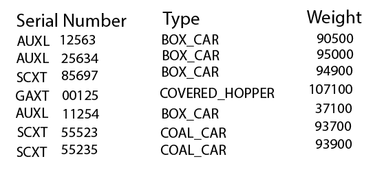

# Train Watch - Web Application and Form Input

> This is the next in a series of exercises to manage information on trains. 
> In this exercise you will create a web application project. 
> **Train Watch** is a site to keep up-to-date on trains across North America. 
>

## Objectives

This exercise will allow you to demonstrate:

- your ability to read and interpret a class diagram
- create a web application with several web pages
- implement a data entry form with input validation
- implement a tabular report from a collection of data
- use a CSV file (append data, read and display)
  
## Overview

You are to create a new ASP.NET 8 Core Blazor Web Application for this exercise. Create the application using Visual Studio 2022 .Net Core 8. Name your wep app project **`TrainWebApp`**. Name your solution **`TrainWatchSolution`**. Place your work in your exercise repository.

To ensure that your web application works, build and run your project.

The styling for your application is up to you. The template for the `web app` project has Bootstrap built in, but you can use any website styling you choose.

### Modify `Home`

Modify the home page to include the following.

- The title of the site (**Train Watch**)
- A simple logo for the site
- One to two paragraph welcome and summary description of the site

### Update the `MainLayout`

Put your name and section identifier in the `<footer>` element for the copyright information.

### Update the `NavMenu`

Also ensure that the menu navigation has the following items.

- A link to the home page (`Home`) with the text "Home"
- A link to the weight scale page (`/WeightScale`) with an appropriate text
- A link to the weight report page (`/WeightReport`) with an appropriate text
- A link to the privacy page (`/Privacy`) with the text "Privacy"
  - include any Credit and attributions for images tht are used and you did not create
- Create your own or find an image that you wish to use as a brand image for your menu. (If you are using the supplied bootstrap menu, change the *brand* from a text string to a thumbnail imagine 40 X 40 pixels.) If you are using an image that someone else created, make sure that you give credit to the individual on your Privacy page.
  
### Add `Data` folder and file

Add a folder called `Data` to your web application project. You will place your CSV files into this folder. Create 3 text files within this folder. For testing, add the first three lines from the sample report below.

- a file consisting of only good data
- a file consisting of both good and bad data
- an empty file

### Add `Model` folder and class definition

A zip file has been supplied for you. This file contains the Model folder. Unpack the file and place the Model folder into your web application project. Below are the class diagrams of the Model files.

> ### `Pages you create should have a feed back and error message area`

### Add `WeightReport` Page

Add a "Weight Report" page to display the recording of railcar scale weights from a CSV file. A mockup image of the required report is supplied. You will supply an appropriate tilte for the page. You will read the file and create a collection using your RailCarLoad class. Your page will display this collection. Display a message if the collection is empty. Your page must process the entire data file and report any record that does not meet the expected input format. Review the CarWeight class Parse method for expected data record format.

### Add `WeightScale` Page

Add a "Weight Scale" page with to allow the recording of railcar scale weights to a CSV file (append mode). A mockup image of the required page is supplied. Your page does not need to have the same layout **but** must use the variety of controls within the mockup for the same data. You will validate the incoming data and display any fields in error. Use the CarWeight class as a guide for validation. Individual unique error messages will be used to indicate the error. The owner selection and serial number combined make up the railcar serial number.

#### Validation

- All fields are required.
- Scale weight must be numeric, greater than 0.

#### Submit buttons

- **Record** will validate the incoming data and save to the CSV file if correct.
- **Clear** will reset the form to empty input state. (Use a warning dialogue to get a user okay )
- **Go to Report** will transfer the user to the Weigth Report page. (Use a warning dialogue to get a user okay )

Use the class called `CarWeight` to hold the incoming data. The class diagram has been supplied (above). The ToString() will be used to create the record for the CSV file.

----

## Submission

Commit your work in your **exercise** repository and sync to github.com.

## Evaluation

> ***NOTE:** Your code **must** compile. Solutions that do not compile will receive an automatic mark of zero (0).*
> 
> If you are unable to get a portion of the assignment to compile, you should:
> - Comment out the non-compiling portion of code
> - Identify the non-compiling portion with a **Incomplete Requirements** heading, noting the item's
>  

## Marking Rubric

| Weight | Description |
| ----   | --------- |
| **1** | Use of supplied CarWeight class |  
| **1** | Use of RailCarType enum |  
| **1** | Site Navigation |  
| **1** | Home page |
| **1** | Privacy page |
| **5** | Report page (testing of good, bad and empty files, File I/O, report presentation) |
| **5** | Data Entry page (form presentation, File I/O, validation, prompt dialogue) |

----
