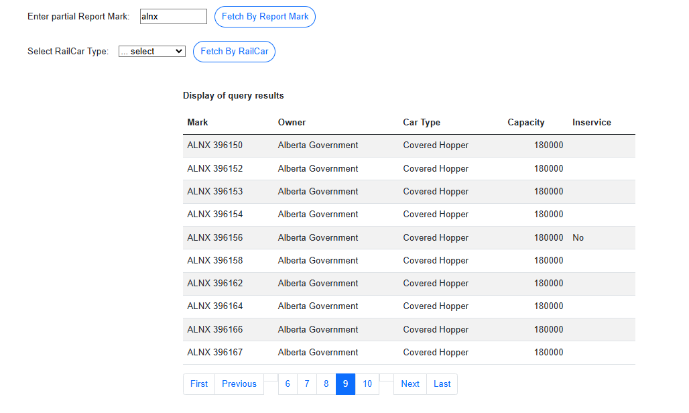
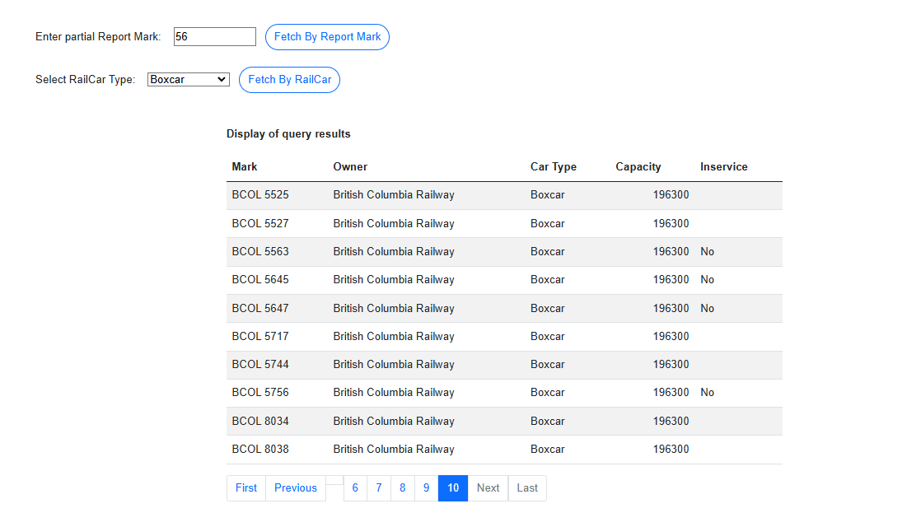

# Train Watch - Ex04 - Client Server - Query using Database  

> This is the next in a series of exercises where you will be building a website to manage information on trains. 
> In this exercise you will create a Client Server application solution. **Train Watch** is a site to keep up-to-date on trains across North America.
>
## Objectives

This exercise will allow you to demonstrate:

- your understanding of basic Client-Server architecture
- your ability to create a Client-Server solution consisting of a web application and application class library
- set up your application class library to interact with a database using EntityFramework with entities created by Reverse Engineering
- create a series of server services to return data from the class library to your web page
- implement a tabular report from a collection of data supplied by a service call to your class library
- demonstrate your understanding of filter searches to obtain data from a database using appropriate Linq queries

## Overview

You are to create a Client Server solution containing a Blazor .Net 8.0 web application and an application library (.Net 8.0 class library).
Use the following names:
- Solution: `CSTrainWatch`
- Web Application: `TrainWatchApp`
- Application Library: `TrainWatchSystem`.

You will configure your web application to use the class library via dependency injection. You will create a new page that will display a tabular report using data returned from a class library service.

Use the demos presented in your class as a guide to implementing this exercise.

## 1. Restore Database

A new database called [TrainWatch](./TrainWatch.bacpac) has been supplied to you for this exercise.

Use Microsoft SQL Management Studio (use Import Data-tier Application) to restore the `TrainWatch.bacpac` file as the exercise database.

**The database is to be named `TrainWatch`.**

## 2. Client Server solution creation

- Create the web application project first.
- Create the class library second.
- Add 3 subfolders to this project: BLL, DAL, and Entities.

*Remember that Github does not track empty folders, so you might wish to add a dummy.txt file in each folder
 if you intend to commit and push at this time. You may remove these dummy files as you add other files to the folder.*

## 3. Application Library (Back-End)

### A) Create and Verify Entities

You will use reverse engineering, via EF Core Power Tools, to create your entity classes that map to the database. 

- Your EF Core verion should be EF Core 8.
- Select all tables.
- Take the default Context name and namespace. 
- Place the entity classes in your Entities folder and the context class in your DAL folder.  


### B) Verify DAL Context

In the "DAL" folder, a file called `TrainWatchContext.cs` was created which will contain the `TrainWatchContext` class. 

- Ensure it inherits from `DbContext`.
- Your class should have a constructor for DbContextOptions<> options injection.
- Change the access level of the context class to **internal**.

*Your DbSet properties for your entity classes should also be present.*

### C) Extension class creation

This class will contain the dbcontext and transient registerations that will be available for dependency injection in your web application.

The class method will be called in the web application `Program.cs` file. 

- Create a class called `TrainWatchExtensions` at the root of the application library. Change the class to be public static. 
- Add the static method `TrainWatchDependencies`. Check you class demo for appropriate parameters.
- Within the method, you will register your DbContext and the AddTransient factory for your BLL service classes. 

As you code, you will need to resolve references to needed namespaces holding your context class and service classes.

### D) BLL Services

You will need to create each of the services below.

- Each service class will need an appropriate internal constructor that requires an instance of the `TrainWatchContext` as a parameter. 
- Save the parameter value into a private readonly variable. As you code, you will need to resolve references to needed namespaces holding your context class and entity class.
- Once you have created the class, register the class in your extension method via AddTransient. 
- **If a method has a parameter, ensure one was passed and, if not, throw an `ArgumentNullException`.**

#### **I) RailCarTypeServices**

In this class, create a public method called `GetRailCarTypes()` that:
- Has no parameters
- Returns an ordered collection (by name) of all records of the RailCarTypes entity. 

#### **II) RollingStockServices**

In this class, create a public method called `GetStockByReportMark(string)` that:
- Has one parameter
- Returns a collection of all RollingStock records where the ReportMark contains the parameter value.
- The parameter value will be a partial ReportMark. 

In this class, create a public method called `GetStockByCarType(int)` that:
- Has one parameter
- Returns a collection of all RollingStock records where the RailCarType matches the parameter value.
- The parameter value will be a RailCarType. 

After creating these classes, rebuild your Application Class Library. You should get a successful build.

## 4. Web Application (Front-End)
### A) Create your database connection string in the appsettings.json file.

```csharp
"ConnectionStrings": {
    "TWDB" : "Server=xxxx;Database=TrainWatch;Trusted_Connection=true;MultipleActiveResultSets=true"
  }
```
Replace the "Server=xxxx" in the above with your server name as demonstrated in class.

### B) Setup the service dependency registration for the web application  

This will be done within your `Program.cs` file. Use your class lesson demonstration to complete this process.
You will need to add a project reference to the web application pointing to the class libray.

### C) Overview Query Page

- Create a `Query.razor` web page component.
- Use project dependency injection for the `RailCarTypeServices` and `RollingStockServices` classes. 
- Be sure to add a nav item so that this page can be navigated to using the nav menu. Use the text "Query" for the link.
- Add an appropriate title to the page and the title browser tab.

Details of your display can be found below:

The `Query` page will display summary information on the rolling stock data in an HTML table with headings:

- `ReportingMark`
- `Owner`
- `Car Type`
- `Capacity`
- `InService`

#### Requirements:
- Inservice will display either a blank (indicating true) or the string No (indicating false).
- This query page will have two filters: Partial Search String and Drop Down List. 
- The return query data will be of the same layout from both queries.
- Each filter will have its own event button requiring an event method. 
- Add a `Clear` button to reset both search arguments.

#### Partial Search String Filter

- Allow the user to enter a partial search string to filter on any portion of the reporting mark data (e.g.: "BN" or "50"). 
- Present all of the records that have any of the partial data in the reporting mark as a table.

#### Drop Down List Filter

- Allow the user to pick a car type from a dropdown menu and retrieve all of the cars of that type. 
- Present all of the records of that car type in a table.

### Samples

Only present the data fields as shown below:

**ReportMark Filter Page**



**RailCar Type Filter Page**



## Submission

Commit your work in your **exercise** repository and sync to github.com.

## Evaluation

> ***NOTE:** Your code **must** compile. Solutions that do not compile will receive an automatic mark of zero (0).*
> 
> If you are unable to get a portion of the assignment to compile, you should:
> - Comment out the non-compiling portion of code
> - Identify the non-compiling portion with a **Incomplete Requirements** heading, noting the item's
>  

## Marking Rubric

| Weight | Description |
| ----   | --------- |
| **1** | Requested Web Application |  
| **1** | Requested class library Application |  
| **1** | Entities/DAL via Reverse Engineering |  
| **1** | Project reference setup and required NuGet packages |  
| **2** | RailCarType service class |
| **2** | RollingStock service class |
| **3** | Query Entry page - web page controls |
| **3** | Query Entry page - event processing |
| **1** | Clear button - control and event processing |

----- 

| Weight | Breakdown |
| ----- | --------- |
| **1** | 1 = Complete (requirement is met, class standards&nbsp; meet; project requirements&nbsp; meet; contains acceptable coding structures)<br />0 = Incomplete (requirement not met, missing large portions, major errors, class standards not meet; project requirements not meet; contains unacceptable coding structures) |
| **2** | 2 = Proficient (requirement is met, class standards&nbsp; meet; project requirements&nbsp; meet; contains acceptable coding structures)<br />1 = Acceptable (requirement is partially met, errors, some class standards not meet; some project requirements not meet; contains some unacceptable coding structures)<br />0 = Incomplete (requirement not met, missing large portions, major errors, class standards not meet; project requirements not meet; contains unacceptable coding structures) |
| **3** | 3 = Proficient (requirement is met, class standards&nbsp; meet; project requirements&nbsp; meet; contains acceptable coding structures)<br />2 = Capable (requirement is adequately met, minor errors; some class standards not meet; some project requirements some not meet; contains some unacceptable coding structures)<br />1 = Limited (requirement is partially met, major errors, some class standards not meet; some project requirements not meet; contains some unacceptable coding structures)<br />0 = Incomplete (requirement not met, missing large portions, major errors, class standards not meet; project requirements not meet; contains unacceptable coding structures) |
----
